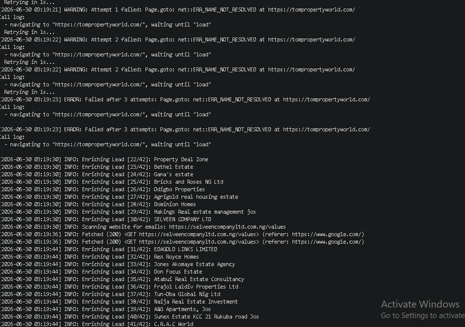

# 🕷️ AI-Driven Local Lead Generation Pipeline (Powered by Scrapling)

An automated, human-mimicking web scraping and business intelligence pipeline designed to extract local business leads from Google Maps and dynamically enrich them with corporate contact emails.

Built using the ultra-stealthy **[Scrapling](https://github.com/D4Vinci/Scrapling)** framework, this project bypasses complex anti-bot detection systems natively, exports data cleanly to a spreadsheet format, and operates with built-in human-behavior simulation to protect your IP footprint.

---

## 🚀 Key Features

*   **Dynamic Targeting Input:** Prompts the user interactively for the business industry (e.g., real estate, plumbing) and the localized area (City, State, Country).
*   **Built-in Anti-Bot & CAPTCHA Mitigation:** Natively leverages **[Scrapling's](https://github.com/D4Vinci/Scrapling)** `anti_bot=True` argument to tap into advanced browser fingerprinting evasion and automatic bypass loops.
*   **Dual-Stage Enrichment Pipeline:**
    *   **Stage 1:** Scrapes business name, maps URL, phone number, and outbound corporate website directly from Google Maps.
    *   **Stage 2:** Automatically deep-crawls discovered business websites via Regex to parse out public-facing corporate email addresses (`info@...`, `contact@...`, etc.).
*   **Strict Human Mimicry:** Avoids immediate rate-limiting or blocking by utilizing random jitter delays (`human_sleep`) between sidebar scrolls (5–10s), website hops, and multi-minute cooling breaks between complete location cycles.
*   **Fail-Safe Data Appending:** Automatically writes directly to a spreadsheet (`enriched_leads.csv`), dynamically verifying if the file exists to append data cleanly without ever overwriting historical leads.

---

## 🛠️ Architecture & How It Works

The engine is built on a split-logic pipeline to keep data collection efficient and lightweight:


```

[User Input] ➔ [Google Maps Search] ➔ [Infinite Sidebar Scroll]
│
┌─────────────────────────────────────────┘
▼
[Extract Basic Details] ➔ [Filter Out Duplicates] ➔ [Deep Scan Target Website]
│
┌────────────────────────────────────────────────────┘
▼
[Regex Parse Emails] ➔ [Format Discovered N/A Data] ➔ [Safe Append to CSV]

```

### 1. Interactive Parameter Ingestion
The pipeline boots by prompting the user for targeted parameters. It seamlessly joins these variables into a singular query string structured for Google Maps parsing algorithms (e.g., `real estate agency in Brooklyn New York USA`).

### 2. Stealth Browser Initialization & Page Actions
Instead of running blindly in the background, the pipeline spins up a visible instance (`headless=False`) using **[Scrapling's](https://github.com/D4Vinci/Scrapling)** `StealthyFetcher`. It hooks a custom Python macro (`scroll_sidebar`) directly into the active browser page context via the `page_action` callback. This targets the infinite scrolling container (`div[role="feed"]`), simulating realistic viewport scroll-downs and allowing lazy-loaded HTML components to populate organically.

### 3. Structural Node Parsing
Using scoped XPath and CSS selectors, the script iterates through the container nodes. It safely extracts strings and attributes while using logical error boundaries to default any missing fields to a clean string format (`"N/A"`), ensuring database structural uniformity.

### 4. Deep Email Web Crawling
Once the target listings are extracted, the script executes individual outbound request cycles to the listed business sites. It reads the raw text payloads and runs a non-backtracking regular expression engine to fish out valid email configurations while filtering out junk media formats (like `.png` or `.webp` string paths).


------





------

## 📦 Installation & Setup

1. **Clone the Repository:**
   ```bash
   git clone [https://github.com/YOUR_USERNAME/your-repository-name.git](https://github.com/YOUR_USERNAME/your-repository-name.git)
   cd your-repository-name

```

2. **Initialize a Virtual Environment:**
```bash
python -m venv maps_env
# Activate on Windows:
maps_env\Scripts\activate
# Activate on macOS/Linux:
source maps_env/bin/activate

```


3. **Install Core Engine & Browser Binary Dependencies:**
```bash
pip install "scrapling[fetchers]"
scrapling install

```


---

## 💡 How to Run

Execute the pipeline wrapper file from your terminal:

```bash
python scraper.py

```

### Script Execution Configuration Options

Inside the `__main__` entry block, you can easily alter your strict batch parameters:

* `MAX_LEADS`: Controls the absolute cutoff threshold per target area search (Default: `100`).
* `max_scrolls`: Dictates the maximum infinite scroll iterations in the sidebar view.

```

